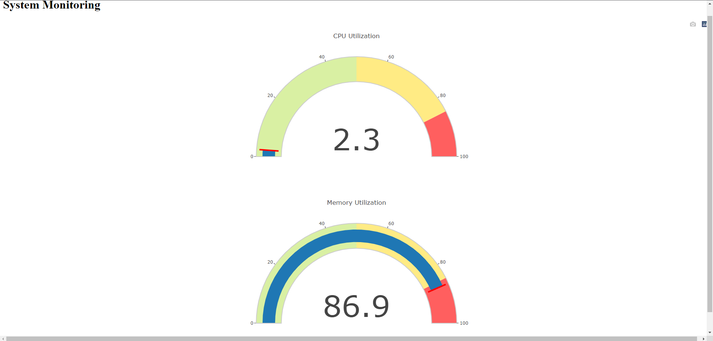
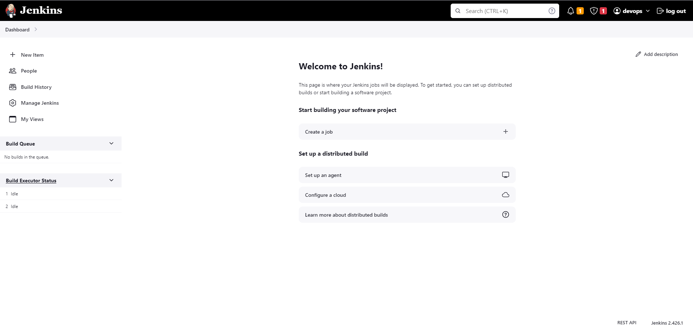
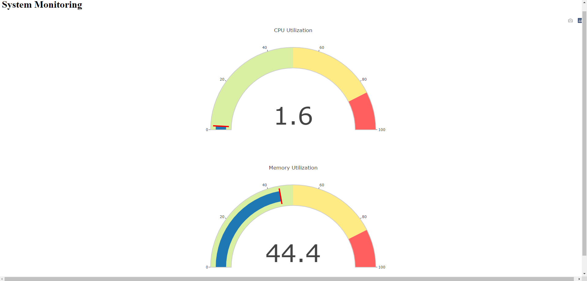

# **CICD with Jenkins for App Deployment on AWS EKS using Terraform** 

## Things you will Learn 🤯

1. How to create Monitoring Application in Python by using Flask and psutil
2. How to run a Python App locally.
3. How to containerize a Python App by creating a Dockerfile
4. Create AWS ECR repository by using Python Boto3 and pushing Docker Image to ECR by using Jenkins
5. Create AWS EKS Cluster by using Terraform
6. Deploy the App on K8s

## **Prerequisites** 

(Things to have before starting the projects)

- [x]  AWS Account.
- [x]  Programmatic access and AWS configured with CLI.
- [x]  GitBash installed.
- [x]  Python3 Installed.
- [x]  Code editor of your choice (VSCode)
- [x]  Terraform installed.

# Let’s Start the Project 

## **Part 1: Deploying the Flask application locally**

### **Step 1: Clone the code**

Clone the code from the repository:

```
git clone https://github.com/teodor1006/cicd-jenkins-eks.git
```

### **Step 2: Install dependencies**

The application uses the **`psutil`** and **`Flask`, Plotly, boto3** libraries. Install them using pip:

```
pip3 install -r requirements.txt
```

### **Step 3: Run the application**

To run the application, navigate to the root directory of the project and execute the following command:

```
python3 app.py
```

This will start the Flask server on **`localhost:5000`**. Navigate to [http://localhost:5000/](http://localhost:5000/) on your browser to access the application.



## **Part 2: Create a IAM User on AWS**

### **Step 1: Create IAM User**

```
Name: <name>
Set Permissions -> Attach Policies directly -> Administrator Access
```

### **Step 2: Create Access Key for IAM User**
After creating the IAM User -> click on it and go to Security Credentials -> Create Access Key -> Download it and remember where you store it

## **Part 3: Launch an EC2 Instance for Jenkins**
```
Name: jenkins
Ubuntu 22.04 Free Tier eligible
Instance type: t2.medium
Create new key pair and store it in your project folder
Create security group:
  Name: jenkins-sg
  Description: Security Group for Jenkins and WebApp
  Inbound rules: SSH 22 from MyIP, HTTP 80 from Anywhere, HTTPS 443 from Anywhere, CustomTCP 8080 from MyIP, CustomTCP 5000 from MyIP            
```

## **Part 4: Installing Jenkins and Configuring Jenkins**

### **Step 1: Configure AWSCLI**

After your EC2 Instance is up and running, go to your project folder and open gitbash:

```
ssh -i <your key name.pub> ubuntu@<your ipv4 address from the EC2 Instance>
Click on yes

sudo -i  (to switch to root user)
apt update && apt upgrade && apt install awscli -y
aws configure
  AWS Access Key ID: <your id>
  AWS Secret Access Key: <your secret key>
  Default region name: us-east-1  (Or your region)
  Default output format: json
```

### **Step 2: Install Java and Jenkins**

Copy the following scripts and paste them in your jenkins ec2 instance.

```
apt install openjdk-11-jdk -y
apt install git python-pip3 -y

curl -fsSL https://pkg.jenkins.io/debian-stable/jenkins.io-2023.key | sudo tee \
  /usr/share/keyrings/jenkins-keyring.asc > /dev/null

echo deb [signed-by=/usr/share/keyrings/jenkins-keyring.asc] \
  https://pkg.jenkins.io/debian-stable binary/ | sudo tee \
  /etc/apt/sources.list.d/jenkins.list > /dev/null

apt update -y

apt install jenkins -y

systemctl start jenkins && systemctl enable jenkins
systemctl status jenkins
```

### **Step 3: Configure Jenkins**

Copy the IPv4 from your jenkins EC2 Instance and paste it in your browser. Make sure to add :8080 at the end. Jenkins runs on port 8080.


To get the password type in the console:

```
cat /var/lib/jenkins/secrets/initialAdminPassword
```

After that you should get to the login field. You can type whatever you want in there. Make sure to remember your username and password.


After that click on Install suggested plugins.




Now you should be in your main menu.

Now go to Manage Jenkins -> Plugins -> Available Plugins and install these:

```
DockerPipeline
Docker
AWS Credentials
AWS ECR
```

After installing the plugins go to Manage Jenkins -> Credentials -> System -> Global credentials -> Click on Add Credentials


Make sure to give the Access Key ID and Secret Access Key from your stored IAM User. Otherwise you won't be able to push a ECR Image to AWS ECR.


## **Part 4: Installing Docker on Jenkins Server**

Copy and paste this code in gitbash (your running jenkins EC2 Instance).

```
sudo apt-get update
sudo apt-get install ca-certificates curl gnupg
sudo install -m 0755 -d /etc/apt/keyrings
curl -fsSL https://download.docker.com/linux/ubuntu/gpg | sudo gpg --dearmor -o /etc/apt/keyrings/docker.gpg
sudo chmod a+r /etc/apt/keyrings/docker.gpg

# Add the repository to Apt sources:
echo \
  "deb [arch="$(dpkg --print-architecture)" signed-by=/etc/apt/keyrings/docker.gpg] https://download.docker.com/linux/ubuntu \
  "$(. /etc/os-release && echo "$VERSION_CODENAME")" stable" | \
  sudo tee /etc/apt/sources.list.d/docker.list > /dev/null
sudo apt-get update

sudo apt-get install docker-ce docker-ce-cli containerd.io docker-buildx-plugin docker-compose-plugin

sudo systemctl enable docker
sudo usermod -aG docker ubuntu
sudo usermod -aG docker jenkins
```

To check if you installed docker correctly run the following command:
```
systemctl status docker
```
You should see that the docker is active running!


## **Part 5: Dockerizing the Flask application**

### **Step 1: Create a Dockerfile**

Create a **`Dockerfile`** in the root directory of the project with the following contents:

```
# Use the official Python image as the base image
FROM python:3.9-buster

# Set the working directory in the container
WORKDIR /app

# Copy the requirements file to the working directory
COPY requirements.txt .

RUN pip3 install --no-cache-dir -r requirements.txt

# Copy the application code to the working directory
COPY . .

# Set the environment variables for the Flask app
ENV FLASK_RUN_HOST=0.0.0.0

# Expose the port on which the Flask app will run
EXPOSE 5000

# Start the Flask app when the container is run
CMD ["flask", "run"]
```

### **Step 2: Create an ECR Repository using Python (Boto3)**
Reminder: make sure you have awscli configured on your local machine before running this code

```
import boto3

ecr_client = boto3.client('ecr')

repository_name = "flask_image"
response = ecr_client.create_repository(repositoryName=repository_name)

repository_uri = response ['repository']['repositoryUri']
print(repository_uri)
```
After running this code -> Go to AWS ECR -> Repositories and you should see your created repo.


### **Step 3: Push the Docker Image to ECR by using Jenkins**

To create a pipeline in jenkins click on Create a job:


```
Pipeline from SCM 
Git
URL: <url_from_project> 
Branch: */main
path: Jenkinsfile
```

The Jenkinsfile looks like that: 

```
pipeline {
    agent any

    environment {
        registryCredential = 'ecr:us-east-1:awscreds'
        appRegistry = '865893227318.dkr.ecr.us-east-1.amazonaws.com/flask_image'
        monitorRegistry = "https://865893227318.dkr.ecr.us-east-1.amazonaws.com"
    }

    stages {
        stage('Checkout and Install Dependencies') {
            steps {
                checkout scm
                script {
                    sh 'pip3 install -r requirements.txt'
                }
            }
        }
        
        stage('Build App Image') {
            steps {
                script {
                    dockerImage = docker.build("${appRegistry}:${BUILD_NUMBER}", "./")
                }
            }
        }

        stage('Upload App Image') {
            steps {
                script {
                    docker.withRegistry(monitorRegistry, registryCredential) {
                        dockerImage.push("${BUILD_NUMBER}")
                        dockerImage.push('latest')
                    }
                }
            }
        }
    }
}
```

Build the Jenkins Pipeline in order to push the Image to ECR.


After pushing the Docker Image you should see it:


## **Part 6: Setup GitHub Webhook and update Jenkins Job**

Go to Github repository, Settings -> Webhooks -> Add JenkinsURL with /github-webhook/ at the end.

Next we will go to Jenkins and add below configuration to our flask-app job.

```
Build Trigger: GitHub hook trigger for GITScm polling
```
Now if you make a change and push it to github. The pipeline should be triggered automatically.

## **Part 7: Create EKS Cluster using Terraform**

### **Step 1: Create S3 Bucket**
Go to AWS S3 -> Create bucket -> Give it a unique name -> Keep the rest as default 
Make sure to update the name of your bucket and region in the terraform.tf file

### **Step 2: Run the EKS Cluster**
Run the following commands in gitbash:

```
terraform init
terraform fmt 
terraform validate
terraform plan -out planfile
terraform apply -auto-approve -input=false -parallelism=1 planfile
```

Allow up to 15 minutes for the bucket creation process to complete!!!

After that you should see your keyfile in the S3 Bucket.

### **Step 3: Create Deployment and Service yaml File for K8s**

```
apiVersion: apps/v1
kind: Deployment
metadata:
  name: my-flask-app
spec:
  replicas: 1
  selector:
    matchLabels:
      app: my-flask-app
  template:
    metadata:
      labels:
        app: my-flask-app
    spec:
      containers:
      - name: my-flask-container
        image: "865893227318.dkr.ecr.us-east-1.amazonaws.com/flask_image:latest"
        ports:
        - containerPort: 5000

---
apiVersion: v1
kind: Service
metadata:
  name: my-flask-service
spec:
  selector:
    app: my-flask-app
  ports:
  - port: 5000
```

Make sure to change the image URI with yours.

### **Step 4: Deploy the App on K8s**

Configure 'kubectl' on AWS EKS by running the following command:

```
aws eks update-kubeconfig --region <your region> --name <your cluster name>
```
After that run the following commands:

```
kubectl apply -f dep-serv.yaml
kubectl get deployment
kubectl get pods
kubectl get service
```
Once your pod is up and running, run the port-forward to expose the service:

```
kubectl port-forward service/<service name> 5000:5000
```
Go to your browser and type: localhost:5000
You should be able to see your deployed app!!!




## **Part 7: Delete the EKS Cluster**

Run the following command:

```
terraform destroy -auto-approve
```